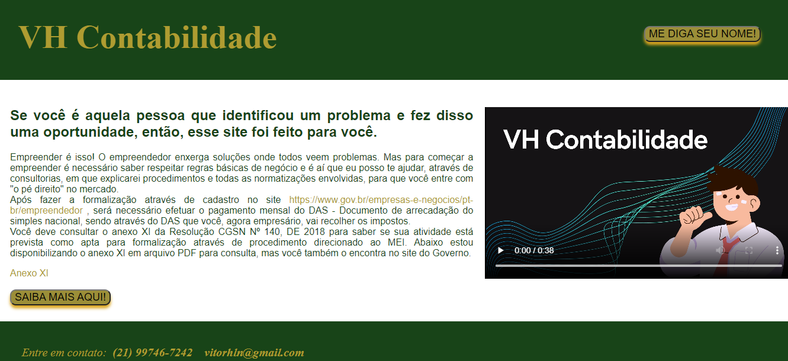
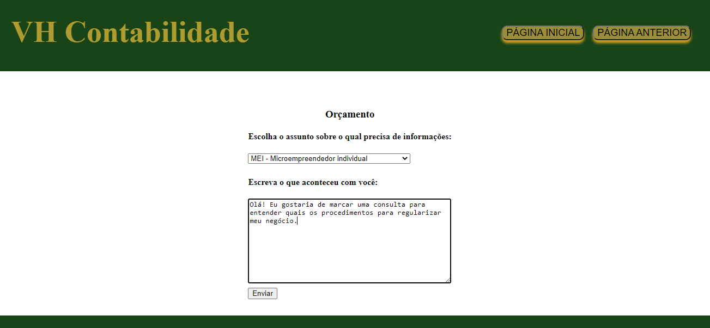

# VH_Contabilidade 👨🏽‍💼💵

 Objetivo: Este é um site que está sendo desenvolvido para facilitar o pedido de orçamento e melhorar a divulgação de meio de contato de um prestador de serviço contábil. Trata-se de um site para expor as informações que foram solicitadas e fazer um formulário que abre no e-mail do cliente para ser enviado. O site também permite o contato direto, por meio do e-mail e do telefone do prestador do serviço.

 

### 🛠 Tecnologias

As seguintes ferramentas foram usadas na construção do projeto: HTML5, CSS3 e JS.
<h4 align="center"> 
	🚧  Projeto 🚀 Em construção...  🚧
</h4>
Autora: Renata Silva Bezerra

